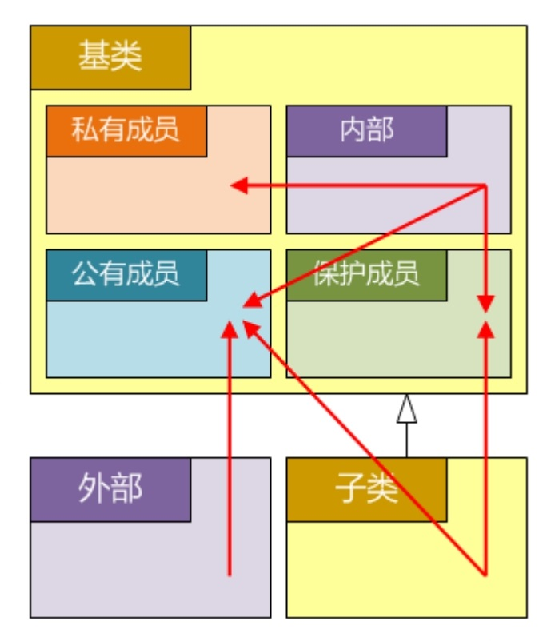

# 面向对象

## 什么是面向对象

* 万物皆对象，这是人类面对世界最朴素最自然的感觉、想法和观点
* 把大型软件看成是一个由对象组成的社会
* 对象拥有足够的智能，能够理解来自其他对象的信息，并以适当的行为做出反应
* 对象能够从高层对象继承属性和行为，并允许底层对象从自己继承属性和行为等
* 编写程序的过程就是描述对象属性和行为的过程，凭借这种能力是问题域和解域获得最大成都的统一
* 面向对象三大要件：封装、继承、多态

## 为什么要面向对象

* 相比于分而治之的结构化程序设计，强调大处着眼的面向对象程序设计思想，更适合于开发大型软件
* 得益于数据抽象、代码复用等面向对象的固有特征，软件开发的效率获得极大的提升，成本却大幅降低
* 面向对象技术在数据库、网络通信、图形界面等领域的广泛应用，已催生出各种设计模式和应用框架
* 面向对象技术的表现如此出众，以至于那些原本并不直接支持面向对象的语言（如C），也越来越多的通过各种方法模拟一些面向对象的软件架构

## 怎样面向对象

* 至少成我一种面向对象的程序设计语言，如C++
* 深入理解封装、继承、多态等面向对象的重要概念
* 精通一种元语言（如UML），在概念层次上描述设计
* 学习设计模式，源自多年成功经验的积累和总结

## 类和对象

* 拥有相同属性和行为的对象被成一组，即一个类
* 类可用于表达那些不能直接与内置类型建立自然映射关系的逻辑对象
* 类是一种用户自定义的复合数据类型，即包括表达属性的成员变量，也包括表达行为的成员函数
* 类是现实世界的抽象，对象是类在虚拟世界的实力

## 类的定义与实例化

* 类的一般形式

  ```
  class/struct 类名: 继承方式 基类, ... {
  访问控制限定符:
      类名(形参表):成员变量(初值), ... {
          函数体;
      }
      ~类名() {
          函数体;
      }
      返回类型 函数名(形参表) 常属性 异常说明{
          函数体;
      }
      数据类型 变量名;
  };
  ```

* 访问控制限定符
  * `public`：公有成员，谁都能访问
  * `protected`：保护成员，只有自己和子类可以访问
  * `private`：私有成员，只有自己能访问
  * 在C++中，类（struct）和结构（struct）已经没有本质的差别，唯一的不同在于：
    * 类的缺省访问控制属性为私有（private）
    * 结构的缺省访问控制属性为公有（public）
  * 访问控制限定符仅作用于类，而非作用于对象，因此同一个类的不同对象，可以互相访问非公有部分
  * 对不同成员的访问控制属性加以区分，体现了C++作为面向对象程序设计语言的封装特性
  
  

* 构造函数
  * 函数名和类名相同，且没有返回类型
  * 在创建对象时自动被调用，且仅被调用一次
    * 对象定义语句
    * new操作符
  * 为成员变量赋初值，分配资源，设置对象的初始状态
  * 对象创建过程
    * 为整个对象分配内存空间
    * 以构造实参调用构造函数
      * 构造基类部分
      * 构造成员变量
      * 执行构造代码

* 类的声明与实现分开
  ```
  class 类名 {
    返回类型 函数名(形参表);
  };
  
  返回类型 类名::函数名(形参表) {
    函数体;
  }
  ```
* 对象的创建于销毁

  * 在栈总创建单个对象

  ```
  类名 对象;
  类型 对象(实参表);
  ```

  * 在栈中创建数组对象

  ```
  类名 对象数组[元素个数];
  类型 对象数组[元素个数] = {类型(实参表), ... };
  类名 对象数组[] = {类型(实参表), ... };
  ```
  * 在堆中创建/销毁对象

  ```
  类名* 对象指针 = new 类名;
  类名* 对象指针 = new 类名();
  类名* 对象指针 = new 类名(实参表);
  delete 对象指针;
  ```

  * 在堆中创建/销毁数组
  
  ```
  类名* 对象数组指针 = new 类名[元素个数];
  类名* 对象数组指针 = new 类名[元素个数]{类名(实参表), ...};
  delete[] 对象数组指针;
  ```

  


  


