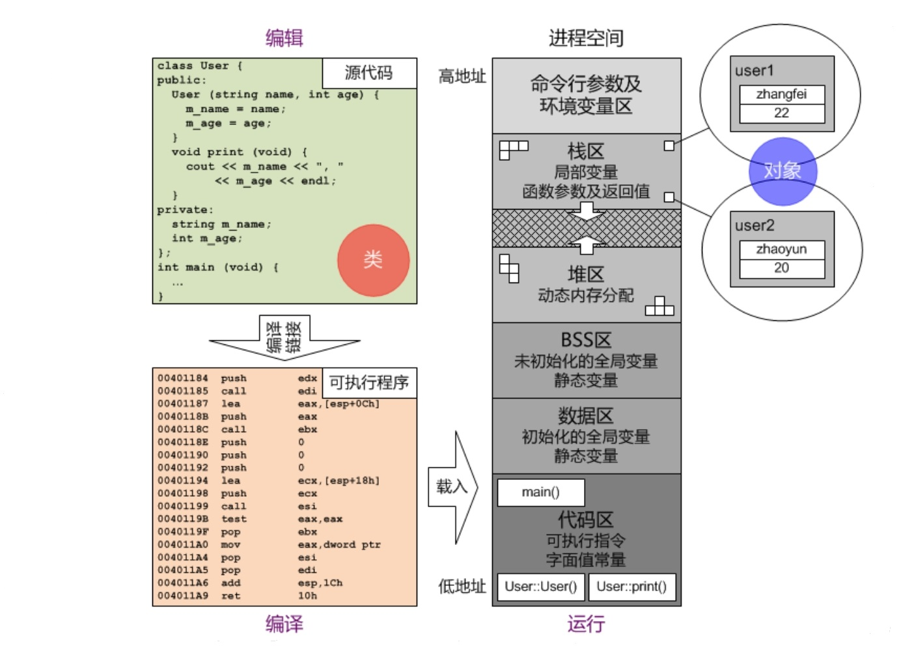

# This指针

## C++对象模型

* 相同类型的不同对象各自拥有独立的成员变量实例
* 相同类型的不同对象彼此共享同一份成员函数代码
* 在代码区中，为相同类型的不同对象所共享的成员，如何区分所访问的成员变量隶属于哪个对象
* 类的每个成员函数、构造函数和析构函数，都有一个隐藏的指针类型参数`this`，指向调用该成员函数、正在被构造或正在被析构的对象，这就是`this指针`
* 在类的成员函数、构造函数和析构函数中，对所有成员的访问，都是同多`this指针`进行的

## This指针的应用

* 多数情况下，程序并不需要显式地使用this指针
* 有时为了方便，将一个类的某个成员变量与该类构造函数的相应参数取相同标识符，这是在构造函数内部，可通过this指针将二者加以区分
* 返回基于this指针的自身引用，以支持串连调用
* 将this指针作为函数的参数，已实现对象交互

