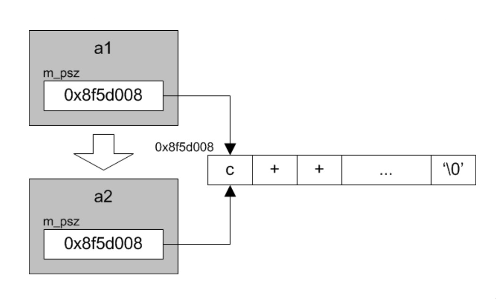
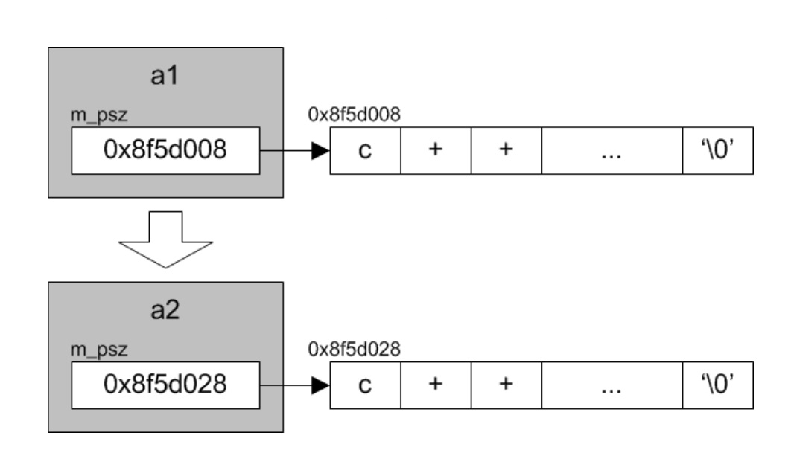

# 拷贝构造与拷贝赋值

* 缺省方式的拷贝构造和拷贝赋值，对包括指针在内的基本类型成员变量按字节复制，导致浅拷贝问题

    

* 为了获得完整意义上的对象副本，必须自己定义拷贝构造与拷贝赋值，针对指针类型成员变量做深拷贝

    

* 相对于拷贝构造，拷贝赋值需要做更多的工作
    * 避免自复制
    * 分配新资源
    * 拷贝新资源
    * 释放旧资源
    * 返回自引用

* 尽量复用拷贝构造函数和析构函数中的代码
    * 拷贝构造：分配新资源、拷贝新内容
    * 析构函数：释放旧资源

* 无论是拷贝构造还是拷贝赋值，其缺省实现对类类型成员变量和基类子对象，都会调用相应类型的拷贝构造和拷贝赋值运算符函数，而不是简单地按字节复制，因此应尽量避免使用指针型成员变量
* 尽量通过引用或指针向函数传递对象型参数，既可以降低参数传递的开销，也能减少拷贝构造的机会
* 出于具体原因的考虑，确实无法实现完整意义上的拷贝构造和拷贝赋值，可将它们私有化，以防误用
* 如果一个类提供了自定义的拷贝构造函数，就没有理由不提供实现相同逻辑的拷贝赋值运算符函数

