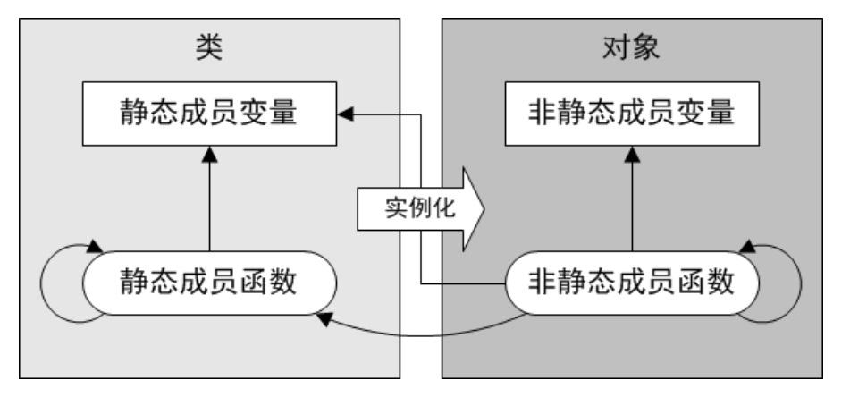

# 静态成员

* 静态成员属于类而不属于对象
    * 静态成员变量不包含在对象实例中，进程级生命期
    * 静态成员函数没有`this`指针，也没有常属性
    * 静态成员依然受类作用域和访问控制限定符的约束
* 静态成员变量的定义和初始化，只能在类的外部而不能在构造函数中进程
* 静态成员变量为该类的所有对象实例所共享
* 访问静态成员，既可以通过类也可以通过对象
* 静态成员函数只能访问静态成员，而非静态成员函数既可以访问静态成员，也可以访问非静态成员
* 事实上，类的静态成员变量和静态成员函数，更像是普通的全局变量和全局函数，只是多了一层类作用域和访问控制属性的限制，相当于具有成员访问性的全局变量和全局函数

  

