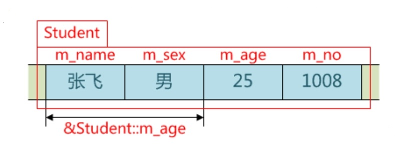

# 成员指针

## 成员变量指针

* 类型 类名::*成员变量指针;
* 成员变量指针 = &类名::成员变量;
* 对象`.*`成员变量指针，对象指针`->*`成员变量指针
* 其本质就是特定成员变量在对象实例中的相对地址，解引用时再根据调用对象的地址计算出该成员变量的绝对地址

    

## 成员函数指针

* 返回类型(类名::*成员函数指针)(形参表);
* 成员函数指针 = &类名::成员函数名;
* (对象`.*`成员函数指针)(实参表)，(对象指针`->*`成员函数指针)(实参表)
* 虽然成员函数指针并不存储在对象中，但也要通过对象或者对象指针对成员函数指针解引用，其目的只有一个，即提供this指针

## 静态成员变量指针

* 类型* 静态成员变量指针;
* 静态成员变量指针= &类名::静态成员变量;
* *静态成员变量指针

## 静态成员函数指针

* 返回类型(*静态成员函数指针)(形参表);
* 静态成员函数指针 = 类名::静态成员函数名;
* 静态成员函数指针(实参表)

静态成员与对象无关，因此静态成员指针与普通指针并没有任何本质区别

