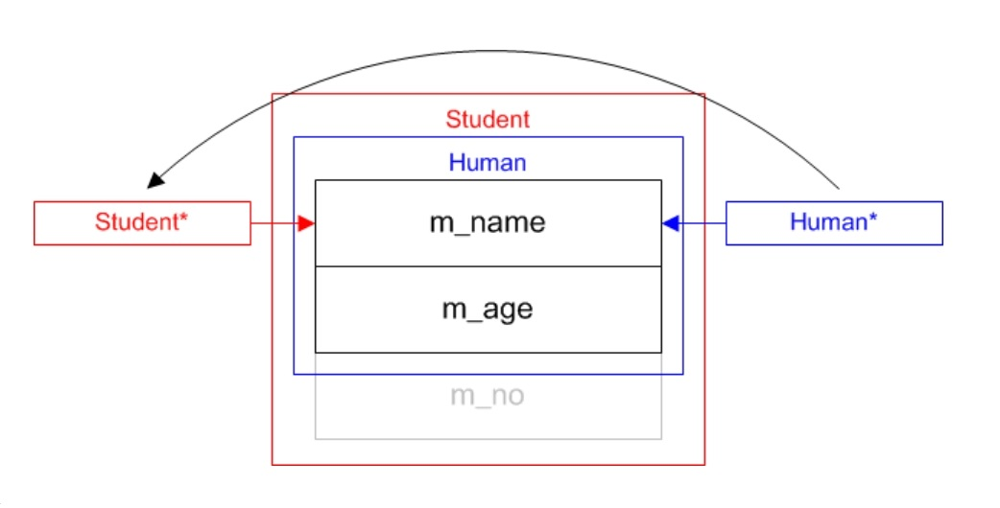

# 继承

## 继承的基本概念和语法

* 共性与个性
* 超集与子集
* 基类与子类
* 继承与派生
* 继承的语法

  ```
  class 子类: 继承方式1 基类1, 继承方式2 基类2, ... {
  	...
  };
  ```

* 继承方式
    * 公有继承：public
    * 保护继承：protected
    * 私有继承：private

## 公有继承的基本特点

* 子类对象任何时候都可以被当做其基类类型的对象
  ```
    class Human {...};
    class Student : public Human {...};
    Student student(...);
    Human* phuman = &student;
    Human& rhuman = student;
  ```
* 编译器认为访问范围缩小是安全的

  

* 基类类型的指针或者引用不能隐式转换为子类类型
  ```
    class Human {...};
    class Student : public Human {...};
    Human human(...);
    Student* pstudent = static_cast<Student*>(&human);
    Student& rstudent = static_cast<Student&>(human);
  ```
* 编译器认为访问返回扩大是危险的

  

* 编译器对类型安全的检测仅仅基于指针或引用本身
  ```
    class Human {...};
    class Student : public Human {...};
    Student student(...);
    Human* phuman = &student;
    Human& rhuamn = student;
    Student* pstudent = static_cast<Student*>(phuman);
    Student& rstudent = static_cast<Student&>(rhuamn);
  ```
* 基类指针或引用的实际目标，究竟是不是子类对象，完全由程序员自己判断
* 在子类中可以直接访问基类的所有公有和保护成员，就如同它们是在子类中声明一样
* 基类的私有成员在子类中虽然存在却不可见，故无法直接访问
* 尽管子类的公有和保护成员在子类中直接可见，但仍然可以在子类中重新定义这些名字，子类中的名字会隐藏所有基类中的同名定义
* 如果需要再子类中或通过子类访问一个在基类中定义却为子类所隐藏的名字，可以借助作用域限定操作符`::`实现


