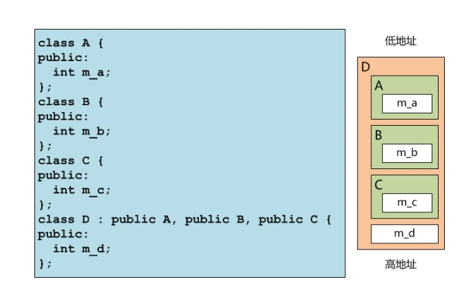
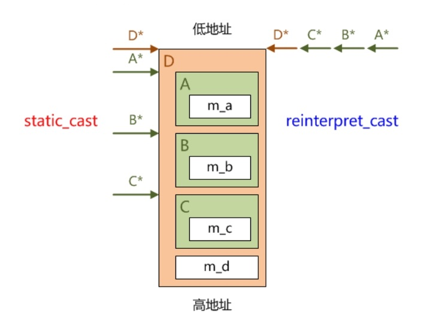

## 多重继承、钻石继承与虚继承

* 一个类可以同时从多个基类继承实现代码

* 多重继承的内存布局和类型转换
  * 子类对象中的多个基类子对象，按照`继承表`的顺序依次被构造，并从`低地址到高地址`排列，析构的顺序则与构造`严格相反`

    
  * 将继承自多个基类的子类类型指针，隐式或静态转换为其他的基类类型，编译器会根据各个基类子对象在子类对象中的内不能布局，进行适当的偏移计算，以保证指针的类型与其所指向目标对象的类型一致
  * 反之，将该子类的任何一个基类类型的指针静态转换为子类类型，编译器同样会进行适当的偏移计算
  * 无论在哪个方向上，重解释类型转换都不进程任何偏移计算
  * 引用的情况与指针类似，因为引用的本质就是指针
  
    

* 围绕多重继承，历来争议颇多
    * 现实世界中的实体本来就具有同时从多个来源共同继承的特性，因此多重继承有助于面向现实世界的问题域直接建立模型
    * 多重继承可能会在大型程序设计中引入令人难以察觉的BUG，并及大地增加对类层次体系进程扩展的难度

