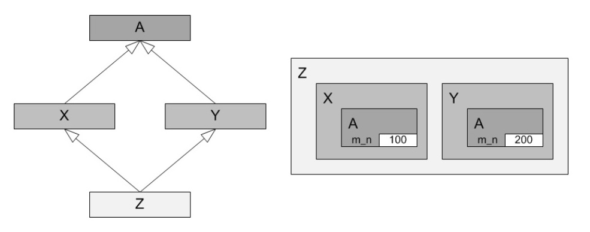
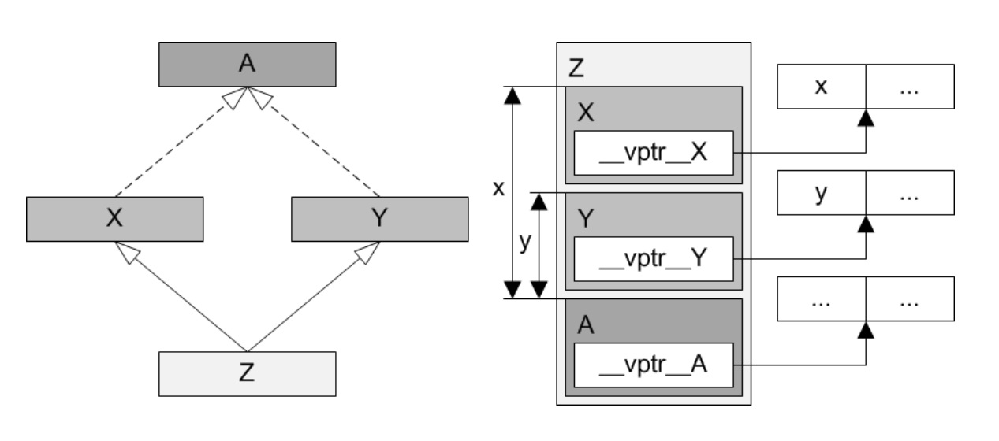

## 钻石继承问题

* 派生多个中间子类的公共基类子对象，在继承自多个中间子类的汇聚子类对象中，存在多个实例

  

* 在汇聚子类中，或通过汇聚子类对象，访问公共基类成员，会因继承路径的不同而导致不一致

* 通过虚继承，可以保证公共基类子对象在汇聚子类对象中，仅存一份实例，且为多个中间子类对象所共享

  

## 虚继承、虚基类、虚表和虚表指针

* 在继承中使用virtual关键字
* 位于继承链最末端的子类的构造函数负责构造虚基类子对象
* 虚基类的所有子类（无论直接的还是间接的）都必须在其构造函数中显式指明该虚基类子对象的构造方式，否则编译器将选择以缺省方式构造该子对象
* 虚基类的所有子类（无论直接的还是间接的）都必须在其拷贝构造函数中显式指明以拷贝构造该虚基类子对象，否则编译器将选择以缺省方式构造该子对象
* 与构造函数和拷贝构造函数的情况不同，无论是否存在虚基类，拷贝赋值运算符函数的实现没有区别
* 汇聚子类对象中的每个中间子类对象都持有一个虚表指针，该指针指向一个被称为虚表的指针数组的中部，该数组的高地址侧存放虚函数指针，低地址侧则存放所有虚基类地对象相对于每个中间子类对象起始地址的偏移量
* 某些C++实现会将虚基类对象的绝对地址直接存放在中间子类子对象中，而另一些实现（比如微软）则提供了单独的虚基类表，但他们的原理都是一样
* 包含虚继承的对象模型

  

