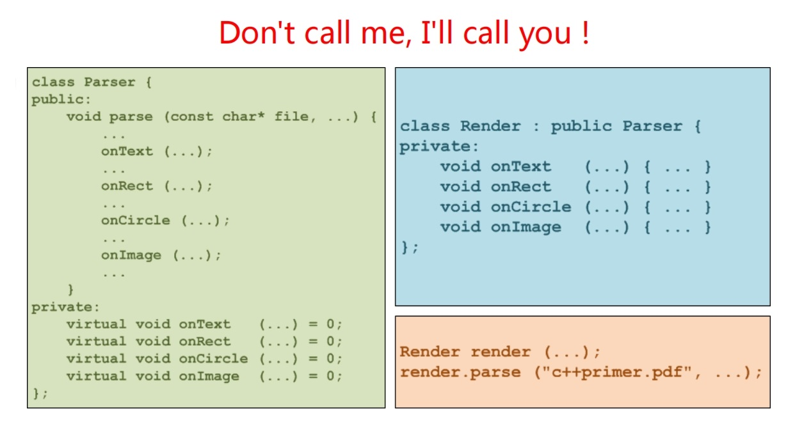

# 纯虚函数、抽象类和纯抽象类

* 纯虚函数
    * 形如
      ```
      class 类名 {
          virtual 返回类型 函数名(形参表) = 0;
      };
      ```
      的虚函数，称为纯虚函数或抽象方法。

* 抽象类
    * 至少拥有一个纯虚函数的类型称为抽象类
    * 抽象类不能实例化为对象
    * 抽象类的子类如果不对基类中的全部纯虚函数提供有效的覆盖，那么该子类也是抽象类

* 纯抽象类
    * 全部由纯虚函数构成的抽象类称为纯抽象类或接口


# 好莱坞模式 - 职责分离




