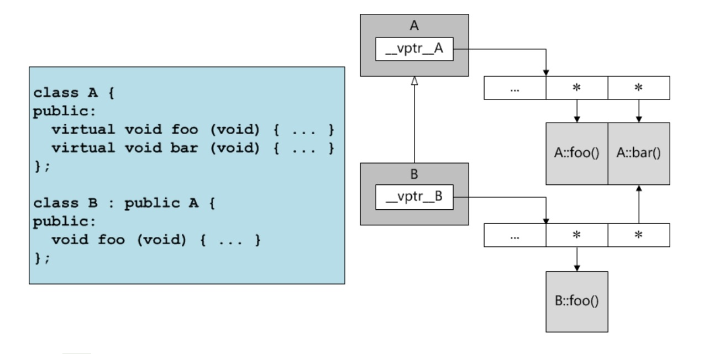

# 虚函数表与动态绑定

## 动态绑定

* 当编译器看到通过指针或引用调用虚函数的语句时，并不急于生成有关函数调用的指令，相反它会用一段代码替代该语句，这段代码在运行时被执行，完成如下操作：
    * 确定调用指针或引用的目标对象的真实类型
    * 从调用指针或引用的目标对象中找到虚函数表，并从虚函数表中获取调用虚函数的入口地址
    * 根据入口地址，调用该函数

* 动态绑定对性能的影响
    * 虚函数表本省会增加内存空间的开销
    * 与普通函数调用相比，虚函数调用要多出几个步骤，增加运行时间的开销
    * 动态绑定会妨碍编译器通过内联来优化代码
    * 只有在确实需要多态特性的场合才是用虚函数，否则尽量使用普通函数

    

