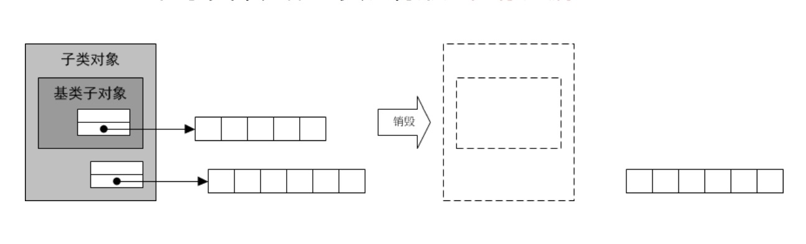
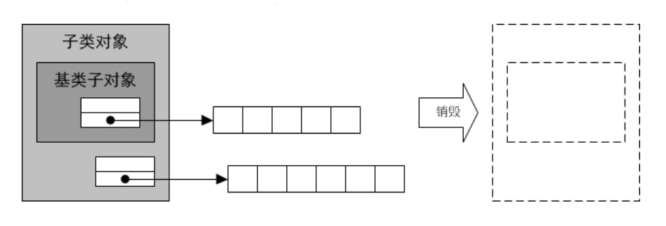

# 虚析构

* delete一个指向子类对象的基类指针
    * 实际被调用的仅仅是基类的析构函数
    * 基类的析构函数负责析构子类对象的基类子对象
    * 基类的析构函数不会调用子类的析构函数
    * 在子类中分配的资源将形成内存泄漏
  
  
    * 如果将基类的析构函数声明为虚函数，那么实际被调用的将是子类的析构函数
    * 子类的析构函数将首先析构子类对象的扩展部分，然后再通过基类的析构函数析构该对象基类部分，最终实现完美的资源释放
  
  

* 空虚析构函数
    * 没有分配任何资源的类，无需定义析构函数
    * 没有定义析构函数的类，编译器会为其提供一个缺省析构函数，但缺省析构函数并不是虚函数
    * 为了保证delete一个指向子类对象的基类指针时，能够正确调用子类的析构函数，就必须把基类的析构函数定义为虚函数，即使它是一个空函数

* 一个类中，除了构造函数和静态成员函数外，任何函数都可以被声明为虚函数

