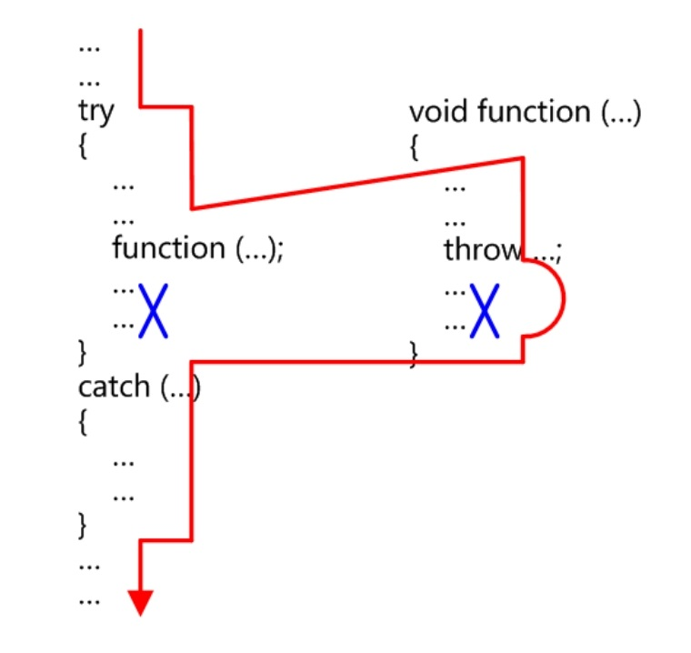

# 异常处理语法

## 抛出异常
* throw异常对象
* 可以抛出基本类型的对象，如
  ```
  throw -1;
  throw "内存分配失败";
  ```

* 可以抛出类类型对象，如
  ```
  MemoryException ex;
  throw ex;
  throw MemoryException();
  ```

* 不要抛出局部对象的指针，如：
  ```
  MemoryException ex;
  throw &ex; //错误
  ```

## 捕获异常

* 语法

  ```
  try {
  	可能引发异常的语句;
  }
  catch(异常类型1& ex){
  	针对异常类型1的异常处理;
  }
  catch(异常类型2& ex){
  	针对异常类型2的异常处理;
  }
  ...
  catch(...){
  	针对其他异常类型的异常处理;
  }
  ```

* 根据异常对象的类型自上而下顺序匹配，而非最优匹配，因此对子类类型异常的捕获不要放在对基类异常的捕获后面
* 建议在catch子句中使用使用接收异常对象，避免因为拷贝构造带来性能损失，或引发新的异常
* 异常对象
  * 为每一种异常定义相应的异常类型
  * 推荐以匿名临时对象的形式抛出异常
  * 异常对象必须允许被拷贝构造和析构（throw的时候要拷贝，catch完成后要释放）
  * 建议从标准库异常中派生自己的异常

* 未发生异常时的流程

  

* 异常发生时的流程

  


