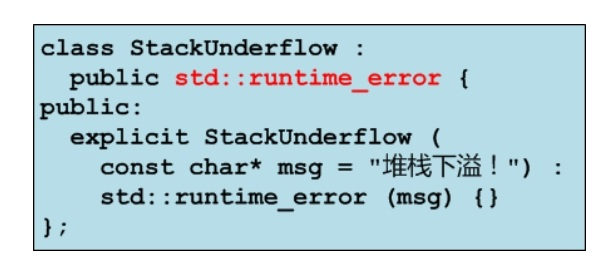

## 异常说明

* 异常说明是函数原型的一部分，旨在说明函数可能抛出的异常类型

  ```
  返回类型 函数名(形参表) throw(异常类型1, 异常类型2, ...) { 
  	函数体; 
  }
  ```

* 异常说明是一种承诺，承诺函数不会抛出异常说明以外的异常类型
    * 如果函数抛出了异常说明以外的异常类型，那么该异常将无法被捕获，并导致进程中止
    * `std::unexpected() -> std::terminate() -> abort()`
* 隐式抛出异常的函数也可以列出它的异常说明
* 异常说明可以没有也可以为空
    * 没有异常说明，表示可能抛出任何类型的异常：`void foo() { ... }`
    * 异常说明为空，表示不会抛出任何类型的异常：`void foo() throw() { ... }`
* 异常说明是虚函数覆盖的条件之一
    * 如果基类中的虚函数带有异常说明，那么子类的覆盖版本不能说明比基类版本抛出更多的异常
* 异常说明在函数的声明和定义中必须保持严格一致，否则将导致编译错误

## 异常处理模式

* 抛出基本类型的异常，根据异常对象的值分别处理
* 抛出类类型的异常，根据异常对象的类型分别处理
* 利用类类型的异常，携带更多诊断信息，以便查错
* 忽略异常，不做处理

  

* 从catch块中继续抛出所捕获的异常，或其他异常
* 任何未被捕获的异常，都会由`std::unexpected()`函数处理，缺省的处理方式是中止进程
* 抛出标准库异常，或标准库异常的子类异常，将允许用户以与标准库一致的方式捕获该异常

  


