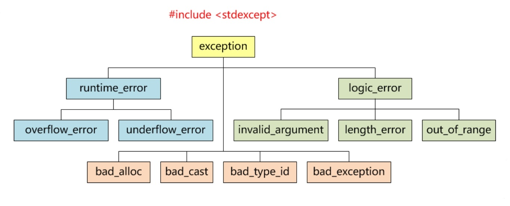

# 析构函数中的异常

* 不要从析构函数中主动抛出异常
    * 在两种情况下，析构函数会被调用
        * 正常销毁对象，离开作用域或显式delete
        * 在异常传递的堆栈辗转开解过程中，由异常处理系统销毁对象
    * 针对第二钟情况，异常正处于激活状态，而析构函数又抛出了一场，并试图将流程转移至析构函数以外，这时C++将通过`std::terminate()`函数，令进程中止
* 对于可能引发异常的操作，尽量内部消化

  ```
  try { ... } catch(...) { ... }
  ```

# 标准库异常




