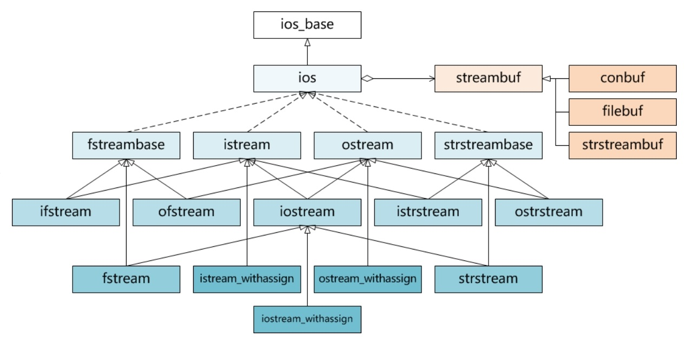
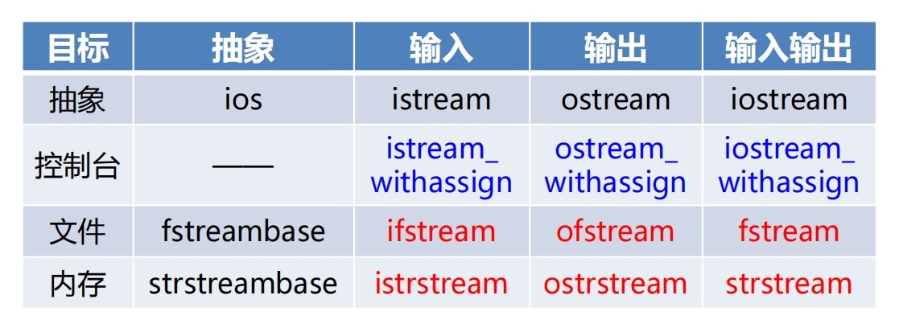

# I/O流的基本概念

* 流（stream）
    * 字节序形式的数据，犹如流水一般，从一个对象流向另一个对象
* 输入流（Input Stream）
    * 数据字节从表示输入设备（如键盘、磁盘文件等）的对象流向内存对象，如：`cin>>student;`
* 输出流（Output Stream）
    * 数据字节从内存对象流向表示输出设备（如显示器、打印机、磁盘文件等）的对象，如`cout << student;`

* 流数据（Stream Data）
    * 各种形式的字节序列，二进制数据、文本字符、图片图像、音频视频等
* 流缓冲（Stream Buffer）
    * 介于各种I/O设备和内存对象之间的内存缓冲区
    * 当从键盘输入时，数据首先进入键盘缓冲区，直到按下回车键，才将键盘缓冲中的数据灌注到输入流缓冲区，之后再通过流操作符`>>`进入内存对象
    * 当向显示器输出时，数据首先通过流操作符`<<`从内存对象进入输出流缓冲区，直到缓冲区满活遇到换行符，才将其中的数据灌注到显示器上显示出来。

* 流对象
    * 表示各种输入输出设备的对象，如键盘、显示器、打印机、磁盘文件等，因其皆以流的方式接收或提供数据，故称为流对象
    * 向下访问各种物理设备接口，向上与应用程序交互，中间维护流缓冲区
    * 四个预定义的标准流对象
        * `cin`：标准输入设备——键盘
        * `cout`：标准输出设备——显示器
        * `cerr`：标准错误输出设备——显示器，不带缓冲
        * `clog`：标准错误输出设备——显示器

* 流类（Stream Class）
    * 用于实例化流对象的类
    * `cin`和`cout`分别是`istream_withassgin`和`ostream_withassign`类的对象

* 流类库（Stream Class Library）
    * C++以继承方式定义了一组流类，并将其作为标准C++库的一部分提供给用户
    * 基于流类库可以构建三种形式的流对象
        * 面向控制台的I/O流
        * 面向文件的I/O流
        * 面向内存的I/O流

#  IO流类库

* 流缓冲类（streambuf）
    * 实现对流缓冲区的低级操作，如设置缓冲区、控制缓冲区指针、从缓冲区提取字符、向缓冲区存储字符等
* 控制台流缓冲类（conbuf）
    * 从流缓冲类（streambuf）派生
    * 实现控制光标、设置颜色、定义活动窗口、清屏等功能，为面向控制台的输入输出提供缓冲区管理
* 文件流缓冲类（filebuf）
    * 从流缓冲类（streambuf）派生
    * 实现文件的打开关闭、读取写入、随机访问等功能，为面向文件的输入输出提供缓冲区管理

* 字符串流缓冲类（strstreambuf）
    * 从流缓冲类（streambuf）派生
    * 提供了在内存中进行提取和插入操作的缓冲区管理
* IO流类（ios）及其子类
    * IO流类作为其所有子类的公共抽象虚基类，主要定义用于格式化输入输出和错误处理等成员函数
    * 在IO流泪和它的各级子类中，均含有一个指向流缓冲类（streambuf）特定子类对象的指针
    * 各种流对象的实际输入和输出功能，都是通过相应类型的流缓冲对象实现的

* 以上只有蓝色和红色的9个类，针对具体目标执行具体操作
* 其中蓝色的3个类已经预定义了cin/cout/cerr/clog流对象
* 实际变成中主要使用红色的6个类实现针对文件和内存的IO
* 处于某种原因，所有IO流类都不支持拷贝构造和拷贝赋值

* `#include <iostream>`
    * `ios、istream、ostream、iostream`
    * `istream_withassign、ostream_withassign、iostream_withassgin`
* `#include <fstream>`
    * `ifstream、ofstream、fstream`
* `#include <strstream>`
    * `istrstream、ostrstream、strstream`
* `#include <sstream>`
    * `istringstream、ostringstream、stringstream`

# IO流的打开与关闭

* 通过构造函数打开IO流
    * 打开输入流：`ifstream(const char* filename, openmode mode);`
    * 打开输出流：`ofstream(const char* filename, openmode mode);`
    * 打开输入输出流：`fstream(const char* filename, openmode mode);`
* 通过成员函数打开IO流
    * `void open(const char* filename, openmode mode);`
* 其中filename表示文件路径，mode表示打开模式

* 打开模式
    * `ios::in`
        * 打开文件用于读取，不存在则失败，存在则不清空
        * 适用于`ifstream(缺省)/fstream`
    * `ios::out`
        * 打开文件用于写入，不存在则创建，存在则清空
        * 适用于`ofstream(缺省)/fstream`
    * `ios::app`
        * 打开文件用于追加，不能再则创建，存在不清空
        * 适用于`ofstream/fstream`
    * `ios::trunc`
        * 打开时清空原内容
        * 适用于`ofstream/fstream`
    * `ios::ate`
        * 打开时定位文件尾
        * 适用于`ifstream/oftream/fstream`
    * `ios::binary`
        * 以二进制模式读写
        * 适用于`ifstream/ofstream/fstream`
    * 打开模式可以组合使用，比如：
        * `ios::in|ios::out`，表示既读取又写入
    * 打开模式不能随意组合，比如
        * `ios::in|ios::trunc`，清空同时读取没有意义，但是`ios::in|ios::out|ios::trunc`是合理的，清空原内容，写入新内容，同时读取
    * 析构函数和close()成员函数都可以关闭I/O流
