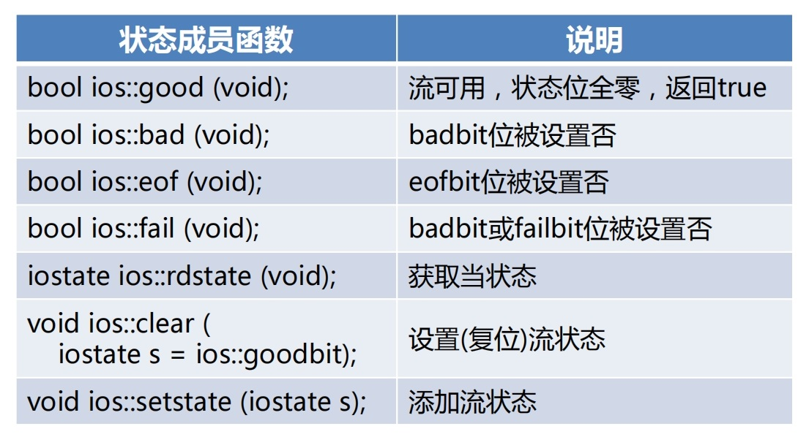
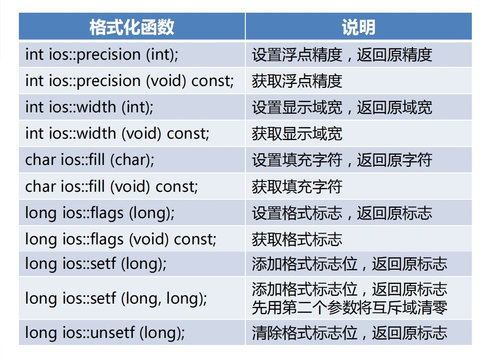

# IO流状态

* IO流内部维护当前状态，其值尾以下常量的位或
    * ios::goodbit：0，一切正常
    * ios::badbit：1，发生致命错误
    * ios::eofbit：2，遇到文件尾
    * ios::failbit：4，实际读写字节数未达预期

* IO流类支持到bool类型的隐式转换
    * 发生致命错误或遇到文件尾，返回false，否则返回true
    * 将IO流对象直接应用到布尔上下文中，即可实现转换
* 处于致命错误或文件尾状态的流，在复位前无法工作

# IO流的状态成员函数

# 格式化IO

* 流函数
    * IO流类定义了一组用于控制输入输出格式的公有成员函数，调用这些函数可以改变IO流对象内部的格式状态，进而影响后续输入输出的格式化方式
* 流控制符（Stream Manipulator）
    * 标准库定义了一组特殊的全局函数，它们有的带有参数（在iomanip头文件中声明），有的不带参数（在iostream头文件中声明），可被直接嵌入到输入输出表达式中，影响后续输入输出格式，称为流控制符

# IO流格式化函数

